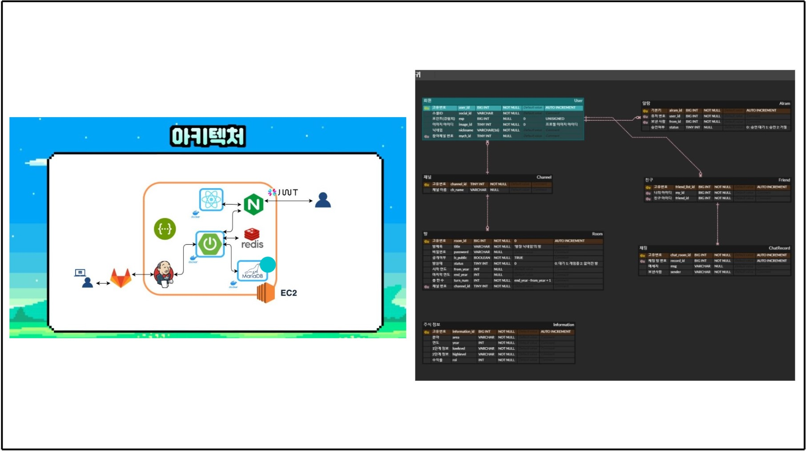
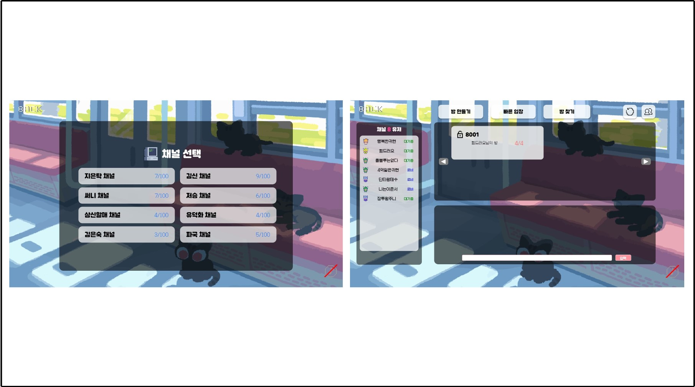

# ”투귀”(투자의 귀재들)

### 청소년을 위한 모의투자 서비스

## 🎥 소개 영상

- [https://www.youtube.com/watch?v=Q-OqLvzrGcM](https://www.youtube.com/watch?v=Q-OqLvzrGcM)

## 🪪배경
여러 측면에서 대두되는 주식(투자)의 중요성

**1) 자산 다변화와 리스크 관리**

- 주식 투자는 자산을 다변화하고 리스크를 분산시키는데 도움을 줌

**2) 인플레이션 대비**

- 인플레이션이 상승할 때, 주식 투자는 자산 가치의 상승에 도움을 줄 수 있음

**3) 수익 창출과 자금 증대**

- 주식 투자는 장기적으로 안정적인 수익을 창출할 수 있는 가능성이 있음

**4) 금융 교육과 경험 획득**

- 주식 투자를 통해 금융 시장에 대한 이해를 향상시키고 경험을 쌓을 수 있음. 이는 개인의 재무 교육과 금융적 자립을 증진시킬 수 있음

하지만 이러한 주식투자를 경험할 수 있는 수단이 부족함을 느꼈습니다

- **교육 부족**
    
    → 많은 청소년들은 주식투자에 대한 교육이나 정보를 받을 기회가 부족함. 학교 교육 과정에서 금융 교육이 부족하거나 주식투자와 관련된 실전 경험을 제공하는 프로그램이 부족한 경우가 많음
    
- **금융 리터러시 부족**
    
    → 많은 청소년들은 금융 리터러시(재정적 지식과 이해)가 부족함. 주식투자에 필요한 금융 용어와 기본 개념에 대한 이해가 부족하거나 미숙할 수 있음.
    
- **자금 부족**
    
    → 청소년들은 주식투자를 위해 충분한 자금을 가지고 있지 않을 수 있음
    

따라서 청소년들이 접근하기 쉬운 게임이란 수단을 통해 주식 관련 경험과 지식 기르고, 
더불어 투자에 대한 재미를 경험할 수 있는 서비스를 기획하였습니다

## 🚩 개발기간

|           |     [프로젝트 일정]     |
| :-------: | :---------------------: |
| 진행 기간 | 2024.02.19 - 2024.04.05 |
|   인원    |           6명           |

## 주요 기술

⚒️**Backend**
- java17
- springboot 3.2.3
- spring jpa
- spring security
- spring web
- oauth2
- intelliJ IDE
- WebSocket
- QueryDSL

⚒️**Frontend**
- Node.js 20.11.0
- VS CODE
- React 18.2.0
- Vite 5.1.4
- Redux 5.0.1
- Redux Tool Kit 2.2.1
- TailWind CSS 3.4.1
- chartJs 4.4.2

⚒️**DataBase**
- mariaDB
- Redis

⚒️**Infra**
- aws ec2
- docker & docker compose
- jenkins

## 협업 툴
- git
- notion
- jira
- mattermost

# 커밋 컨벤션
| Type         | 설명                                                                        |
| ------------ | --------------------------------------------------------------------------- |
| **Feat**     | 새로운 기능 추가                                                              |
| **Fix**      | 버그 수정                                                                    |
| **Refactor** | 리펙토링                                                                     |
| **Design**   | CSS등 사용자 UI 디자인 변경                                                   |
| **Comment**  | 주석 추가 / 변경                                                             |
| **Style**    | 코드 포맷팅, 세미콜론 누락, 코드 변경 없는 경우                                  |
| **Docs**     | 문서 추가, 수정, 삭제                                                         |
| **Test**     | 테스트 관련 코드 추가, 수정, 삭제과 비즈니스 로직 변경 없는 경우                   |
| **Chore**    | 위에 걸리지 않는 기타 변경사항(빌드 스크립트 수정, assets image, 패키지 매니저 등)  |
| **Init**     | 프로젝트 초기 생성                                                            |
| **Rename**   | 파일 혹은 폴더명 수정하거나 옮기는 경우                                          |
| **Remove**   | 파일을 삭제하는 작업만 수행하는 경우                                             |

## 팀원 역할 분배

<table>
 <tr>
    <td align="center"></td>
    <td align="center"></td>
    <td align="center"></td>
    <td align="center"></td>
   <td align="center"></td>
   <td align="center"></td>
  </tr>
  <tr>
    <td align="center"><a href="https://github.com/RyuTa960625"><b>류태수</b></a>
<b>팀장</b>
<b>Front-end</b></td>
    <td align="center"><a href="https://github.com/Agwii"><b>이귀현</b></a>
<b>팀원</b>

<b>Front-end</b></td>
    <td align="center"><a href="https://github.com/wonjunJ"><b>정원준</b></a>
<b>팀원</b>

<b>Back-end</b></td>
    <td align="center"><a href="https://github.com/GEISHAz"><b>정민호</b></a>
<b>팀원</b>

<b>Back-end</b></td>
    <td align="center"><a href="https://github.com/pyunsusie"><b>편수지</b></a>
<b>팀원</b>

<b>Front-end</b></td>
    <td align="center"><a href="https://github.com/quasiwest"><b>이준서</b></a>
<b>팀원</b>

<b>Back-end</b></td>
  </tr>
</table>

 

## 아키텍처 & ERD

## 프로젝트 산출물

- [기획서](https://www.notion.so/158802e9106c44508fea12ced27fb67b)
- [요구사항명세서](https://www.notion.so/0d97404efe6440a1be555b1bb6761981)
- [기능명세서](https://www.notion.so/e866ff1c630643aeb2d0fad8122fee56)
- [API 명세서](https://www.notion.so/API-2e415e6c97104d90adfb6e495316ad14)
- [와이어프레임](https://www.figma.com/file/uwN6GtNOqZaofS7tAStrcs/%ED%88%AC%EA%B7%80-Figma?type=design&node-id=0-1&mode=design&t=mAGctREsmediDbIz-0)
- [커밋 컨벤션](https://www.notion.so/5f97d1535e19418887e2594fad3b34f8)

## 인트로 페이지

## 로그인 & 프로필 페이지

## 허브 페이지 

## 도움말 페이지

## 랭킹 페이지 

## 게임 채널 페이지 & 광장 페이지 

## 빠른 입장

## 방찾기

## 친구 요청 받음

## 친구 추가, 상대방이 친구추가 받음

## 채팅 

## 1단계, 2단계 정보

## 구매정보내역 & 내보유주식

## 매도

## 매수

## 다음턴

## 게임 결과 

